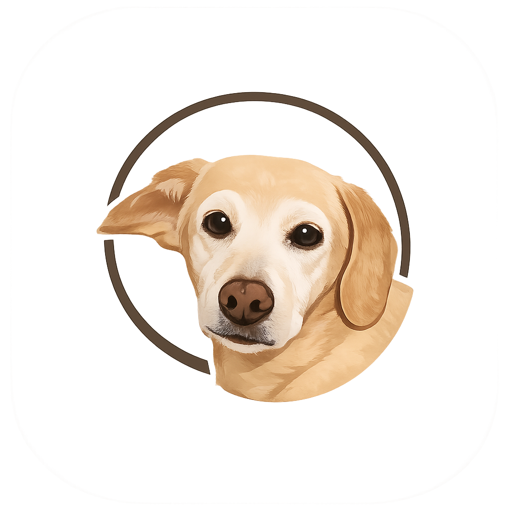

<div align="center">



# Oddinote

**A free, open-source infinite canvas for people whose ideas don't fit on one screen.**

Nested boards, unlimited notes, offline-first. A [Milanote](https://odinote-web.vercel.app/milanote-alternative.html) and [Miro](https://odinote-web.vercel.app/miro-alternative.html) alternative with no card limit and no subscription.

[**▶ Try it in your browser**](https://odinote-web.vercel.app/#try-web) · [**⬇ Download for Windows**](https://github.com/Neuroxcx1/Odinote/releases/latest) · [**📖 User guide**](https://odinote-web.vercel.app/guide.html) · [**🌐 Website**](https://odinote-web.vercel.app)


</div>

<!--
  ⬇ SCREENSHOT / GIF GOES HERE ⬇
  This is the single most important element on this page for converting visitors.
  Edit this file in the GitHub web editor and drag a PNG or GIF right into it —
  GitHub uploads it and generates the link for you. A short GIF (5-10s) showing
  nodes being dragged onto the canvas and a nested board being opened works best.
-->

---

## Why Oddinote exists

Visual canvas tools are wonderful for planning games, novels and creative projects — but the popular ones cap how much you can create (Milanote stops at 100 notes, Miro at 3 editable boards), lock the useful parts behind subscriptions, or keep your work in their cloud.

Oddinote was built by one developer who kept hitting those ceilings while organising game design documents, art references and task boards. It has the same spatial feel, none of the limits, and your files stay on your machine.

## What makes it different: real recursion

A board in Oddinote isn't a folder — it's a **complete canvas**, and any canvas inside it can hold more boards, forever.

```
Root canvas — pitch, core loop, roadmap
└── Art board
    └── Characters board
        └── Mood board per character  →  and deeper, as far as you need
```

Breadcrumbs always show where you are, so you never lose context and never run out of space.

## Features

| | |
|---|---|
| 🌀 **Nested canvases** | Boards inside boards, infinitely recursive |
| 🧩 **19 node types** | Notes, to-dos, documents, images, audio, links, tables, calendars, columns, frames, comments, colour palettes, twenty geometric shapes with text inside, syntax-highlighted code blocks, a pomodoro and countdown timer, any file with its preview, and embedded maps |
| ✏️ **Freehand drawing** | Draw straight on the canvas, with colours and an eraser |
| ↗ **Connectors** | Link any two nodes — curved or right-angle routing, labels and styles |
| 🔒 **Offline & private** | No account required; data lives on your device |
| 📁 **Folders** | Group projects on the home screen — drag a project onto a folder, or bring several in at once. Nothing moves on disk |
| 👥 **Live sessions** | Several people on one canvas, each cursor visible. The browsers talk **directly to each other**; the canvas never passes through a server of ours |
| ☁️ **Optional sync** | Put a workspace online and it syncs through **your own** Google Drive — no server of ours involved |
| ⚡ **Instant sync** | Off by default, per project. Turn it on and note text and positions sync through our server so edits land at once, with nobody hosting — images stay in your Drive |
| 🎨 **Themes & polish** | Dark mode, per-canvas backgrounds, snapping guides, interface sounds |
| 🌍 **11 languages** | English, Spanish, French, German, Italian, Portuguese, Chinese, Japanese, Korean, Arabic, Russian |
| 💾 **Own your data** | Local vault folders with real media files, plus JSON export/import |

## Install

### Windows

Download the latest installer or portable ZIP from the [**Releases page**](https://github.com/Neuroxcx1/Odinote/releases/latest), run it, and you're done.

### Web

No installation, nothing to sign up for: **[odinote-web.vercel.app](https://odinote-web.vercel.app/#try-web)**

### Run from source

```bash
git clone https://github.com/Neuroxcx1/Odinote.git
cd Odinote/App
npm install
npm start
```

Build a Windows executable with `npm run build:exe` (it also writes the release ZIP), or an
installer with `npm run build:installer`. `npm test` runs the test suite — 510 checks, no
framework, plain Node.

## Tech

Electron + React, with JSX transpiled in the browser — no bundler, no build step for the web version. Google Drive integration uses Google's official APIs directly from your device; sign-in uses Firebase Authentication for accounts only. Your note content never touches a server we control, with one opt-in exception: if you switch on **Instant sync** for a project, that project's note text and layout are stored on our Firestore so collaborators see edits immediately. It is off unless you turn it on, it is per project, and images and audio always stay in your own Drive.

### Building from source

The app builds and runs with no setup. Google Drive sync is the one exception:
it needs OAuth credentials, and those are not in this repository. Everything
else — the canvas, nested boards, search, links, the local vault — works
without them.

To enable Drive in your own build:

1. Go to [Google Cloud Console](https://console.cloud.google.com) and pick or
   create a project.
2. **APIs & Services → Credentials → Create credentials → OAuth client ID**.
3. Application type: **Desktop app**.
4. Copy `App/google-oauth.example.json` to `App/google-oauth.json` and paste in
   the two values it gives you.

That file is gitignored but is packaged into the executable, which is what makes
Drive work in a release build.

Google requires the client secret for desktop clients even when using PKCE.
It is not truly confidential — it ships inside any downloadable app and can be
read straight out of the binary, which Google acknowledges for installed apps.
PKCE is what actually protects the flow: every attempt is signed with a one-shot
value only the running process knows, so an intercepted code is useless to
anyone else. Keeping the file out of the repository is about not publishing it
and being able to rotate it later, not about hiding it from users.

## Contributing

Issues and pull requests are genuinely welcome — bug reports especially.

- 🐞 [Report a bug](https://github.com/Neuroxcx1/Odinote/issues)
- 💡 [Suggest a feature or ask a question](https://github.com/Neuroxcx1/Odinote/discussions)
- ☕ [Support development on Ko-fi](https://ko-fi.com/neuroxcx)

If Oddinote is useful to you, a ⭐ on the repo genuinely helps other people find it.

## License

**Apache License 2.0** — see [LICENSE](LICENSE) and [NOTICE](NOTICE).

Use it, study it, change it, build on it, ship it in something commercial. What is asked in
return is **credit**:

- If you redistribute Oddinote — as source, as a build, or inside something you made — keep the
  [NOTICE](NOTICE) file readable in your distribution and say that your work is based on
  **Oddinote by Neuroxcx**, with a link back to this repository. A line in your README, your
  about screen or your credits is the normal way to do it.
- If you changed files, say which ones you changed, so people can tell your work from the
  original.

That is all section 4 of the licence asks. Contributions back to the project are welcome and
always credited, but they are not a condition.

Third-party components keep their own licences — React and Babel (MIT), highlight.js
(BSD-3-Clause), SheetJS (Apache 2.0), Mammoth.js (BSD-2-Clause), html2pdf.js (MIT), project
icons from [Fluent Emoji](https://github.com/microsoft/fluentui-emoji) (© Microsoft, MIT) and
interface icons from [Material Symbols](https://fonts.google.com/icons) (Apache 2.0). The full
list is in [NOTICE](NOTICE).
